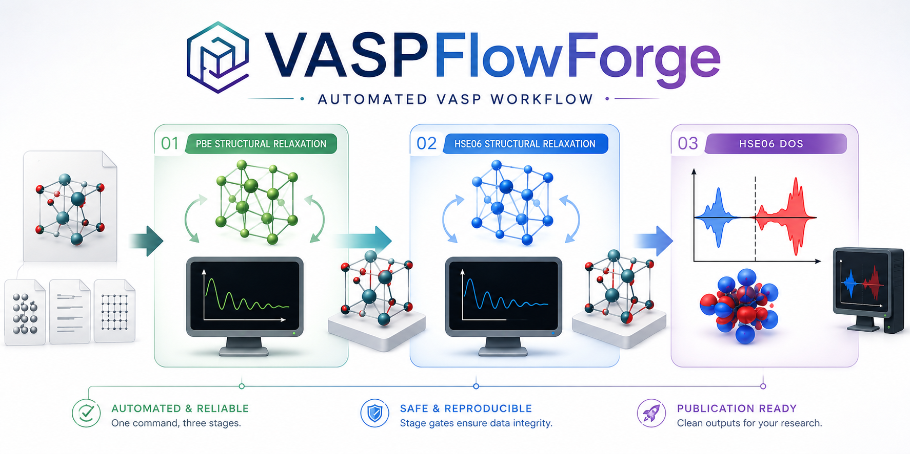

# VASPFlowForge

<p align="center">
  
</p>

<p align="right">
  <strong>English</strong> |
  <a href="README_ja.md">日本語</a>
</p>

**One-command VASP workflow: PBE relaxation -> HSE06 relaxation -> HSE06 DOS.**

VASPFlowForge provides a publication-ready, workstation-oriented automation set
for running a three-stage VASP workflow with strict stage gates. A single shell
command prepares each stage, launches VASP, checks `OUTCAR`, and promotes the
relaxed `CONTCAR` into the next stage as `POSCAR`.

No `POTCAR` files are included in this repository. Users must build `POTCAR`
locally from their own licensed VASP pseudopotential library.

## Purpose

The pipeline generalizes an internally used workflow pattern:

1. Relax the structure with PBE.
2. Copy `01_pbe_relax/CONTCAR` to `02_hse_relax/POSCAR`.
3. Relax the structure with HSE06.
4. Copy `02_hse_relax/CONTCAR` to `03_hse_dos/POSCAR`.
5. Run a static HSE06 DOS calculation.
6. Stop immediately if a stage does not pass the `OUTCAR` completion and
   convergence checks.

```text
00_input/           User-provided inputs: POSCAR, POTCAR, INCAR.*, KPOINTS.*
   |
   v
01_pbe_relax        PBE structural relaxation
   |  OUTCAR gate: completed + reached required accuracy + non-empty CONTCAR
   |  CONTCAR copied to the next POSCAR
   v
02_hse_relax        HSE06 structural relaxation
   |  OUTCAR gate: same as above
   |  CONTCAR copied to the next POSCAR
   v
03_hse_dos          HSE06 static DOS calculation
      OUTCAR gate: completed timing footer + elapsed time
      WAVECAR is reused only when the HSE relax and DOS KPOINTS are compatible
```

If a stage fails, later stages are not created or modified. Re-running the
pipeline skips stages that already pass their checks, so interrupted workflows
can be resumed after the failed stage is fixed.

## Related Projects

VASP automation and post-processing already have excellent open-source
ecosystems. Projects such as `atomate2`, `custodian`, `AiiDA-VASP`, `ASE`, and
`pyiron` support broader workflow management, error handling, HPC integration,
and data infrastructure. Tools such as `sumo`, `PyProcar`, and `VASPKIT` are
widely used for electronic-structure analysis and visualization.

This repository is not intended to replace those projects. Its purpose is
narrower: provide a lightweight, readable bash starter workflow for users who
want a transparent `PBE relax -> HSE06 relax -> HSE06 DOS` chain on a Linux
workstation. The value is in making the stage directories, `OUTCAR` gates,
`CONTCAR -> POSCAR` handoff, and no-`POTCAR` publication policy explicit and
easy to inspect.

## Requirements

- Linux workstation with `bash` and coreutils. The included tests also run on
  macOS.
- Licensed VASP with HSE06 support. The reference module environment is:
  - CPU: VASP 6.4.3 via `module load intel; module load impi; module load vasp`
  - GPU: VASP-GPU 6.4.3 via `module load nvidia; module load nvompi; module load vasp-gpu`
- Licensed VASP PAW pseudopotential library, for example `potpaw_PBE.54`.

VASP itself and `POTCAR` are not distributed here. See
[docs/potcar_policy.md](docs/potcar_policy.md) for the publication policy.

## Repository Layout

```text
scripts/
  run_pbe_hse_dos_pipeline.sh   Main three-stage pipeline script
  preflight_check.sh            Read-only input validation before execution
  check_vasp_done.sh            Standalone OUTCAR completion/convergence checker
  promote_contcar.sh            Validated CONTCAR-to-POSCAR promotion helper
templates/
  INCAR.01_pbe_relax / INCAR.02_hse_relax / INCAR.03_hse_dos
  KPOINTS.01_pbe_relax / KPOINTS.02_hse_relax / KPOINTS.03_hse_dos
  pipeline.conf.example         Example configuration including VASP_CMD
examples/STO/                   SrTiO3 sample case without POTCAR data
docs/                           Workflow, POTCAR policy, and publication checks
tests/                          VASP-free tests with fake OUTCAR/CONTCAR/VASP
```

## Quick Start

1. Copy the example case.

   ```bash
   cp -r examples/STO my_case
   cd my_case
   ```

2. Prepare the required files in `00_input/`.

   | File | Purpose |
   |---|---|
   | `POSCAR` | Initial structure |
   | `POTCAR` | Locally concatenated from your licensed PAW library |
   | `POTCAR.spec` | Public specification of the required POTCAR order |
   | `INCAR.01_pbe_relax` and related files | Stage-specific INCAR files |
   | `KPOINTS.01_pbe_relax` and related files | Stage-specific KPOINTS files |

3. Set the VASP module environment and launch command in `pipeline.conf`.

   CPU example:

   ```bash
   module load intel
   module load impi
   module load vasp
   VASP_CMD="mpirun -np 16 vasp_std"
   ```

   GPU example:

   ```bash
   module load nvidia
   module load nvompi
   module load vasp-gpu
   VASP_CMD="mpirun -np 4 vasp_std"
   ```

   Replace `vasp_std` if your module exposes a different executable name.
   You can also provide `VASP_CMD` as an environment variable.

4. Run a dry run, then execute the pipeline.

   ```bash
   bash ../scripts/run_pbe_hse_dos_pipeline.sh --dry-run .
   bash ../scripts/run_pbe_hse_dos_pipeline.sh .
   ```

For long calculations, run the command inside `tmux` or `screen`, or use
`nohup ... &` according to your workstation policy.

## Run a Real VASP Calculation

The test suite does not run VASP. To launch an actual calculation, start from a
case directory that contains real VASP inputs and a locally built `POTCAR`.

From the repository root:

```bash
cp -r examples/STO my_case
cd my_case
```

Build `00_input/POTCAR` from your licensed PAW library. The STO example needs
`Sr_sv`, `Ti`, and `O` in the order shown in `00_input/POTCAR.spec`.

```bash
VASP_PP=/path/to/your/potpaw_PBE.54
cat "$VASP_PP/Sr_sv/POTCAR" "$VASP_PP/Ti/POTCAR" "$VASP_PP/O/POTCAR" > 00_input/POTCAR
```

Choose the CPU or GPU module environment in `pipeline.conf`.

CPU example:

```bash
module load intel
module load impi
module load vasp
VASP_CMD="mpirun -np 16 vasp_std"
```

GPU example:

```bash
module load nvidia
module load nvompi
module load vasp-gpu
VASP_CMD="mpirun -np 4 vasp_std"
```

Run a dry run first. It validates the inputs and prints the three-stage plan
without creating stage directories.

```bash
bash ../scripts/run_pbe_hse_dos_pipeline.sh --dry-run .
```

Then run the real pipeline.

```bash
bash ../scripts/run_pbe_hse_dos_pipeline.sh .
```

Successful execution creates:

```text
01_pbe_relax/
02_hse_relax/
03_hse_dos/
pipeline_status.tsv
```

The pipeline advances only when the current stage passes its check. If it
stops, inspect the failed stage, fix the input or runtime issue, remove that
failed stage directory, and rerun the same command.

## STO Example

The bundled `examples/STO/` case runs the full PBE relaxation -> HSE06
relaxation -> HSE06 DOS pipeline for cubic SrTiO3 using a 5-atom cell with
`a = 3.899 Angstrom`.

Preparation is the same as the real-run procedure above:

1. Build `00_input/POTCAR` locally according to `00_input/POTCAR.spec`.
2. Load the CPU or GPU VASP 6.4.3 modules and set `VASP_CMD` in
   `pipeline.conf`.
3. Run the dry run and then the real pipeline command.

From the repository root, the STO case can be run directly after `POTCAR` and
`VASP_CMD` are prepared:

```bash
cd examples/STO
bash ../../scripts/run_pbe_hse_dos_pipeline.sh --dry-run .
bash ../../scripts/run_pbe_hse_dos_pipeline.sh .
```

The default k-point meshes and `ENCUT = 520` are starter settings. They have
not been validated as converged production settings. Review the
`CONVERGENCE_REQUIRED` and `USER_CHECK_REQUIRED` notes in the input files
before real use.

In this example, stages 02 and 03 use different `KPOINTS`, so the DOS stage
does not reuse `WAVECAR`. It starts safely with `ISTART = 0` and `ICHARG = 2`.
Even for a 5-atom cell, HSE06 can take meaningful wall time; first confirm that
the PBE stage runs correctly on a small allocation.

## Failure Handling

When the pipeline stops, inspect the failed stage directory.

| File | What to check |
|---|---|
| `vasp.err` | MPI, memory, library, or runtime errors |
| `vasp.out` | VASP stdout, warnings, or symmetry errors |
| `OSZICAR` | Electronic and ionic iteration behavior |
| `OUTCAR` | `reached required accuracy` and timing footer |
| `pipeline_status.tsv` | Stage history and the failed state |

After fixing the cause, remove the failed stage directory and rerun the
pipeline. Stages that already pass their checks will be skipped.

```bash
rm -rf 02_hse_relax
bash ../scripts/run_pbe_hse_dos_pipeline.sh .
```

Common failure cases are described in [docs/workflow.md](docs/workflow.md).

## Tests

The tests do not require VASP.

```bash
bash tests/run_tests.sh
```

They use fake `OUTCAR`, fake `CONTCAR`, and a fake VASP executable to validate
completion checks, `CONTCAR` promotion, stop-on-failure behavior, resume
behavior, and DOS `WAVECAR` reuse switching.

## License

MIT License. See [LICENSE](LICENSE).
